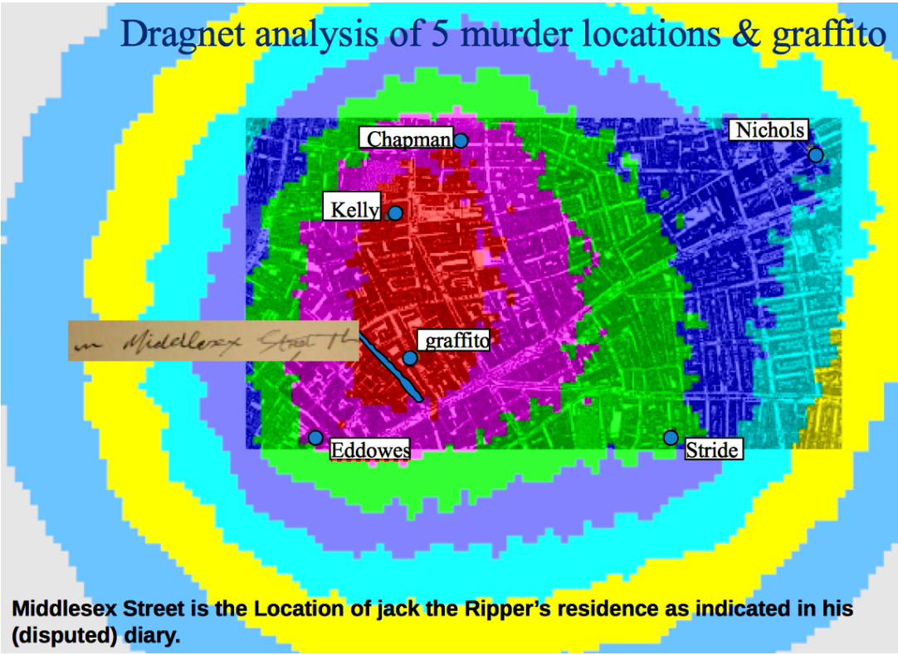
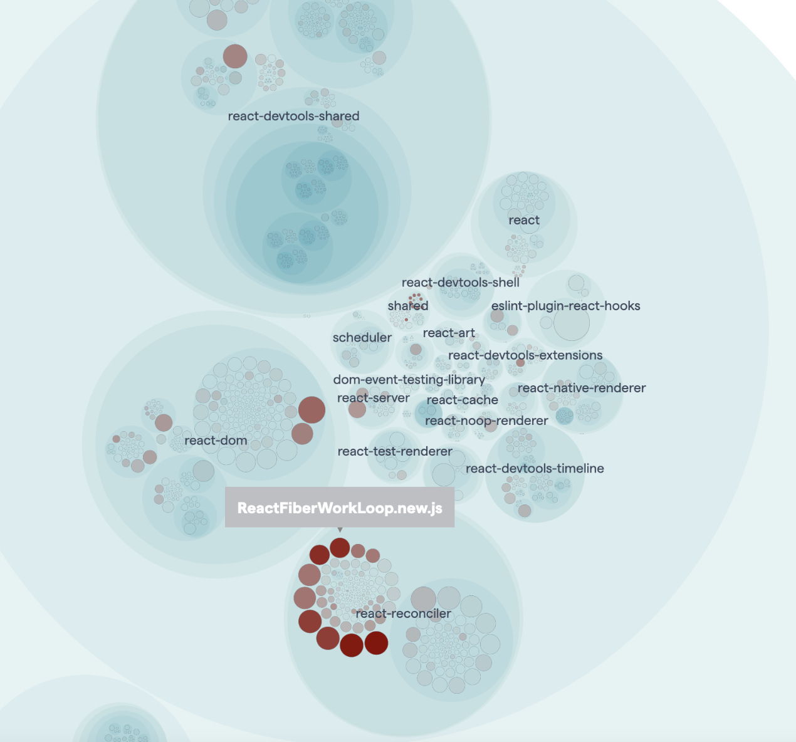
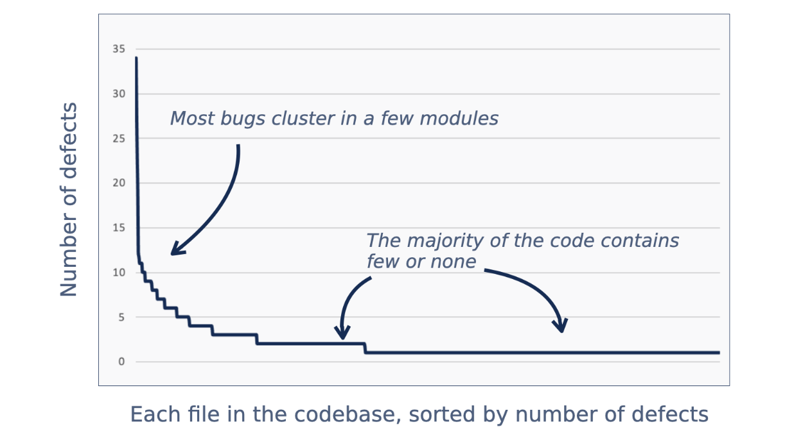
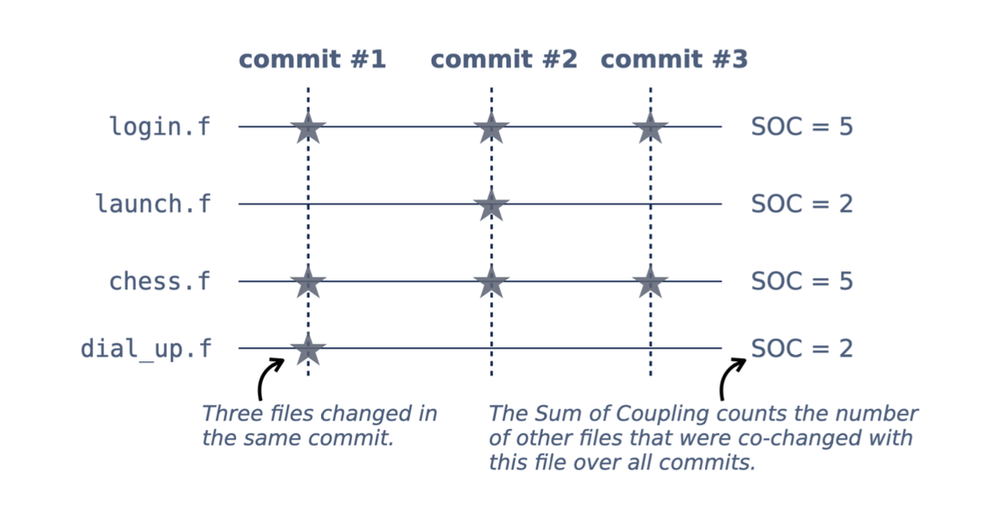

---
# You can also start simply with 'default'
theme: default
# random image from a curated Unsplash collection by Anthony
# like them? see https://unsplash.com/collections/94734566/slidev
#background: https://cover.sli.dev
# some information about your slides (markdown enabled)
title: Your Code as a Crime Scene
info: |
  ## Slidev Starter Template
  Presentation slides for developers.

  Learn more at [Sli.dev](https://sli.dev)
# apply unocss classes to the current slide
class: text-start text-2xl
# https://sli.dev/features/drawing
drawings:
  persist: false
# slide transition: https://sli.dev/guide/animations.html#slide-transitions
transition: slide-left
# enable MDC Syntax: https://sli.dev/features/mdc
mdc: true
---

# Welcome 🕵

#### Before we start
## Go to https://notes.ole.dev/cheatsheet
<br/>

0. Create a GitHub account if you haven't got one
1. Install Docker Desktop on your machine 
(start it after installation. You may need to restart you computer)
2. Install VS Code on your machine
3. Install the Dev Containers extension in VS Code


---
class: text-center
---

# Your Code As A Crime Scene

<div class="grid grid-cols-2 gap-4 h-full items-center">
  <div class="flex flex-col items-center">
    
    <p class="mt-4 text-center">Ole Eskild Steensen<br>Software Developer @ Savvy</p>
  </div>
  <div class="flex flex-col items-center">
    
    <p class="mt-4 text-center">Ida Sofie Grude<br>Software Developer @ Instech Solutions</p>
  </div>
</div>

---
layout: center
title: Book
---

<div class="grid grid-cols-2 gap-4 h-full items-center">
  <div class="flex flex-col items-center">
    
  </div>
  <div class="flex flex-col items-center">
    
    <p class="mt-4 text-center">Adam Tornhill</p>
    
  </div>
</div>

<!--
The gist of the book is using behavioral data, or more precisely git history, to reason about our codebase.

We're using git to investigate our code
we're not experts
-->

---
layout: center
---

# Agenda
<v-clicks>

- Part 1: Word Cloud Demo
- Part 2: Hotspot analysis  
- Part 3: Temporal Coupling
- Part 4: A kinder surprise 🎉

</v-clicks>


---
layout: center
title: cheatsheet
---

# https://notes.ole.dev/cheatsheet

<!--
The cheatsheet contains structured info about stuff.

## Word cloud
Info about the wordart link
Info about the git command

## Looking for clues
Info about the git crimebox

-->


---
layout: cover
title: Word Cloud
---

# ☁️ Word Cloud
## Using our commit message history
  <!--
  https://github.com/GlowstoneMC/Glowstone.git 
  -->

---
class: text-center
layout: cover
---

# Jack the Ripper
<v-clicks>
    <div>
      
      <p class="text-sm italic mt-2">The unsolved Jack the Ripper murders (1888)</p>
    </div>
</v-clicks>

---
layout: cover
---

## Online code editor with all needed tools installed
# https://go.ole.dev/crimebox
### ❗️Remember: All links are available on the cheatsheet

---

# 🔍 Looking for clues 
<!--Remember to tell and show them to go to the cheatsheet and click the github stuff -->
<v-clicks>

- 1. Use commit message history
- 2. Count the total number of times each file has changed
- 3. Count lines of code in each file
- 4. Combine these two
- 5. Visualize the results 
- 6. Expect to be confused! 😵‍💫

</v-clicks>

<!--
It's not obvious why this is useful. 
Ask them if anyone can think of why its nice.
Mention that it's no use in refactoring stable legacy code
Mention that its a nice way to quickly see which files are important
-->

---
layout: cover
---

# Confusing Demo
## Explanation will follow

---
class: text-center text-4xl flex flex-col justify-center
---

# [https://go.ole.dev/crimebox](https://go.ole.dev/crimebox)

---
layout: center
---

# Excercises - Hotspots

- In your github codespace, open up the Excercises/Part 2 - Hotspots, 
and do the excercises there. 

It's not expected that you complete them all. 
We will have a discussion about it afterwards


---

# Code Hotspots: What Are They?

<div class="grid grid-cols-2 gap-4">
  <div class="text-left">
    <p class="mb-4">Areas of code that are:</p>
    <v-clicks>
    <ul>
      <li>Frequently changed</li>
      <li>Complex and hard to understand</li>
      <li>Often involved in bugs</li>
      <li>Technical debt magnets</li>
    </ul>
    </v-clicks>
  </div>
  <div>
    
  </div>
</div>

---

# Counting lines of codes seems too easy

<v-clicks>

- Simple and intuitive
- Performs as well as more elaborate metrics
- > Multiple studies has shown that it performs at the level of more complicated metrics
- It's language neutral

</v-clicks>

---

# Bugs Breed Bugs: The Power Law

<div class="grid grid-cols-2 gap-4">
<div class="text-left">
<ul>
<v-clicks>

<li>The hotspots comprised only 4 % of the code, yet that code
contained 72 % of all defects.</li>
<li>Refactoring 4 % of the code => fix 72% of bugs!</li>
<li>Research shows that </li>
<ul>
<li> > Past bugs predict future bugs</li>
<li> > Bug-fixing often introduces new bugs</li>
</ul>

</v-clicks>
</ul>
</div>
<div>

<p class="text-sm italic mt-2">The power law distribution of defects</p>
</div>
</div>

---
layout: cover
---

# Code reviews

<v-clicks>

- Research shows that code reviews removes defects 👏
- But ... they are time-consuming ⏳
- Use hotpots to identify modules were deeper reviews are good time-investment 🔍

</v-clicks>

---
layout: cover
---

# Onboarding superpowers 🦸


---
layout: cover
---

# Temporal dependencies
## Or change coupling

---
layout: center
---

<!--Example of what coupling is-->


---
transition: none
---

# Explicit dependencies 

```ts{1-6|8-11|8-15|all}
// payment.ts
export class Payment {
  pay(amount: number) {
    console.log(`Paid $${amount}`);
  }
}

// order.ts
import { Payment } from "./payment";

const payment = new Payment();

export function placeOrder() {
  payment.pay(100); // Direct, explicit call
}
```

---

# Implicit dependencies
````md magic-move
```ts
// payment.ts
export class Payment {
  pay(amount: number) {
    console.log(`Paid $${amount}`);
  }
}

// order.ts
import { Payment } from "./payment";

const payment = new Payment();

export function placeOrder() {
  payment.pay(100); // Direct, explicit call
}
```
```ts
// bus.ts
type Listener = (data: any) => void;
const listeners: Listener[] = [];

export function onOrderPlaced(fn: Listener) {
  listeners.push(fn);
}
export function emitOrderPlaced(data: any) {
  listeners.forEach(fn => fn(data));
}

// order.ts
import { emitOrderPlaced } from "./bus";

export function placeOrder() {
  console.log("Placing order...");
  emitOrderPlaced({ amount: 100 }); // No direct link to Payment
}

// payment.ts
import { onOrderPlaced } from "./bus";
onOrderPlaced(data => {
  console.log(`(Implicit) Paid $${data.amount}`);
});

```
````


---

## Reasons 
- Copy-paste - DRY is violated. Easy to address 
- Communication via message bus, network or event 
- Bad encapsulation - Multiple modules needs changing because of low cohesion
- Producer-consumer - Not neccessarily bad


---
layout: image-left
image: ./assets/temporalbig.png
---

### Degree of coupling between LoginCiew.cshtml and OrderAppService.cs?

<br/>

<v-clicks>

# 50%

</v-clicks>


---

# More advanced change coupling algorithms

<v-clicks>

- Time window and author
- Smart commits works across repos and authors ⭐️

</v-clicks>

---

# Sum of Coupling

- Counts number of other co-changed files
- Reveals what the system _really_ is about from an architectural perspective



---

# Show code-maat usage
### Couling Analysis in code-maat
```bash
code-maat -l git_log.txt -c git2 -a coupling | grep -v '\.json' | grep -v '__tests__' > coupling.csv
```

#### Outputs
```bash
entity,coupled,degree,average-revs
packages/dts-test/componentTypeHelpers.test-d.tsx,packages/runtime-core/src/componentTypeHelpers.ts,77,9
packages/runtime-vapor/src/dom/style.ts,packages/runtime-vapor/src/metadata.ts,71,7
packages/compiler-vapor/src/generators/dom.ts,packages/compiler-vapor/src/generators/html.ts,70,9
```
<br/>

### SOC analysis in code-maat
```bash
code-maat -l git_log.txt -c git2 -a soc > soc.csv
```

#### Output 
```bash
entity,soc
packages/runtime-vapor/src/component.ts,876
packages/runtime-vapor/src/index.ts,834
packages/compiler-vapor/__tests__/__snapshots__/compile.spec.ts.snap,754
CHANGELOG.md,698
```

---

# Excercise - Perform change coupling analysis
- In your github codespace, open up the Excercises/Part 3 - Change Coupling, 
and do the excercises there. 
It's not expected that you complete them all.


---
layout: center
---

# The Kinder surprise
